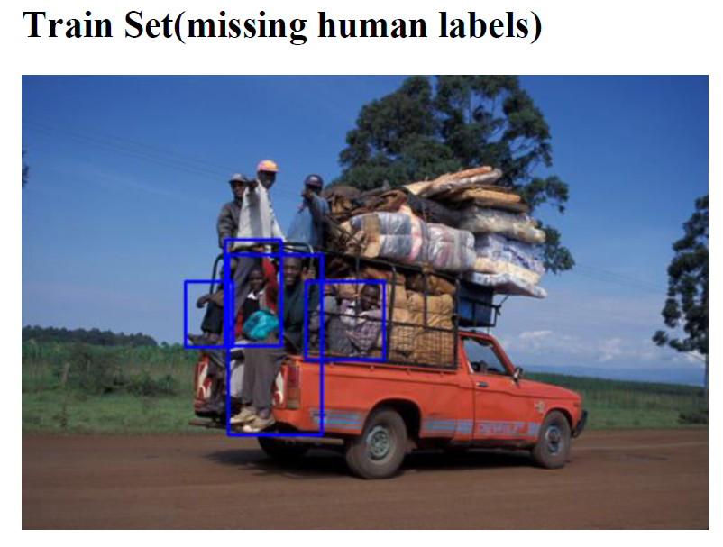
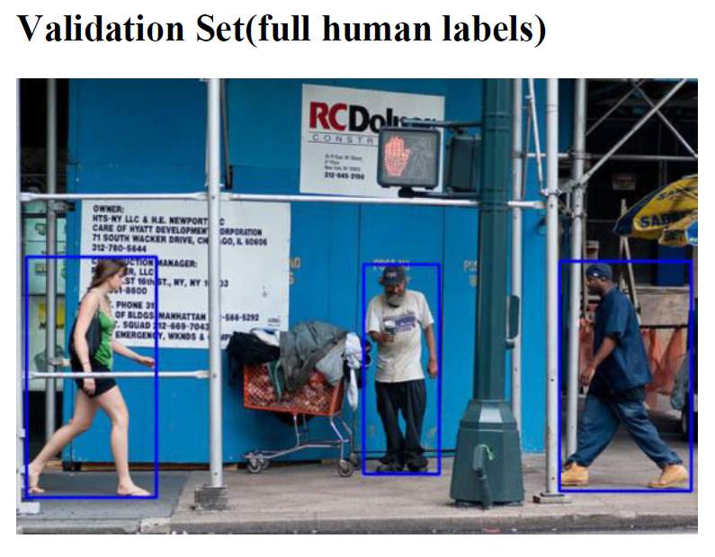

# Missing-Label-Detection

## ZJUI ECE449 Project Code

### Author: 
- Wenhao, Chai
- Chenhao, Li
- Mu, Xie
- Han, Yang

### Project Background

Impressive results have been achieved on object detection benchmarks by supervised object detection
methods. However, the performance of supervised object detection methods is profoundly affected by the
quality of these annotations. For instance, imperfect bounding box annotations or missing annotations of
objects in training images can have a drastic impact on its performance. In this project, you should try to
improve the performance with a missing label train dataset.

We use COCO dataset for this project. The train set has 1000 pictures of human with 30% missing
bounding box. The validation set has 2693 pictures with human labels. You can use mAP (mean Average
Precision) to evaluate your model. For more details about COCO dataset and mAP, please refer to the link
below.

|||
---|---|

### Project Structure
    Missing-Label-Detection
        ├── checkpoints
        ├── image
        ├── log
        ├── models
        │   └── net.py
        ├── tools
        │   ├── eval.py
        │   └── train.py
        ├── utils
        │   ├── criterion.py
        │   ├── datasets.py
        │   └── visulise.py
        ├── configs.py
        ├── LICENSE
        ├── README.md
        ├── requirements.txt