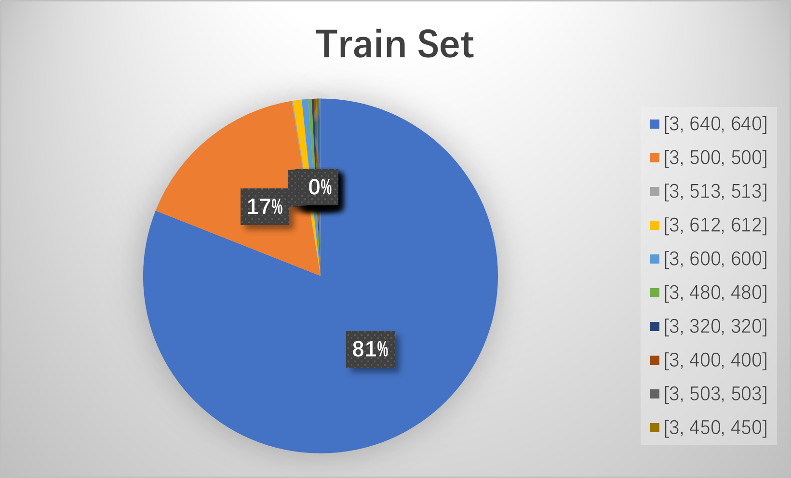
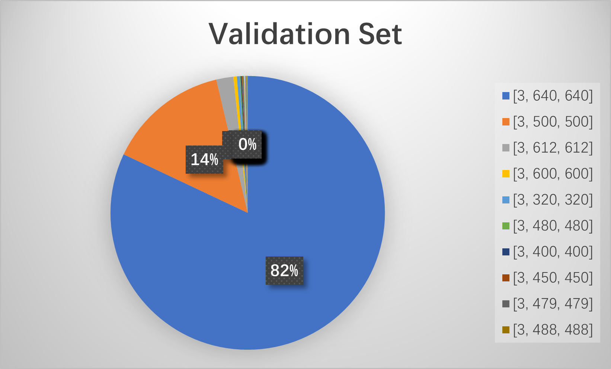

# Missing-Label-Detection

## ZJUI ECE449 Project Code

### Author: 
- Wenhao, Chai
- Chenhao, Li
- Han, Yang
- Mu, Xie

*The whole report is on* [here](https://github.com/Reself-C/Missing-Label-Detection/blob/main/Missing%20Label%20Detection.pdf)

### Project Background

Impressive results have been achieved on object detection benchmarks by supervised object detection
methods. However, the performance of supervised object detection methods is profoundly affected by the
quality of these annotations. For instance, imperfect bounding box annotations or missing annotations of
objects in training images can have a drastic impact on its performance. In this project, you should try to
improve the performance with a missing label train dataset.

We use COCO dataset for this project. The train set has 1000 pictures of human with 30% missing
bounding box. The validation set has 2693 pictures with human labels. You can use mAP (mean Average
Precision) to evaluate your model. For more details about COCO dataset and mAP, please refer to the link
below.

|||
---|---|

### Project Structure
    Missing-Label-Detection
        ├── checkpoints
        ├── cocoapi
        ├── image
        ├── log
        ├── models
        │   ├── common.py
        │   ├── experimental.py
        │   ├── yolo.py
        │   └── yolov5m.yaml
        ├── tools
        │   ├── eval.py
        │   └── train.py
        ├── utils
        │   ├── autoanchor.py
        │   ├── criterion.py
        │   ├── datasets.py
        │   ├── general.py
        │   ├── google_utils.py
        │   ├── metrics.py
        │   ├── torch_utils.py
        │   └── visulise.py
        ├── configs.py
        ├── LICENSE
        ├── README.md
        └── requirements.txt

### Dataset Structure
We do the statistic about dataset. The following shows the distribution of image shape and related number. It is easy to see that this dataset has three characteristics remarkable. 
- A small number of train set, with only 1000 images, while the validation set has 2693 images in total. So, we need to do some data augmentation. For now, we only do a random flip.
- Although train set has 13 kinds of shapes and validation set has 25 kinds of shapes, the distribution is interesting. Basically, images are distributed in two main sizes. For train set, 81% distributed in [3,640,640] and 17% in [3,500,500]. For validation set, 82% in [3,640,640] and 14% in [3,500,500]. Other image size types only have relatively small percentages of distributions compared with two main size types.
- We also notice that the percentage of images with no label in train set is high, about 15.1%, but all images in validation set are labeled. Therefore, we need to consider how to treat those images with no label in train set. Currently, we decided to add a target box to cover the whole image and modify the loss function accordingly.
The following figures show the distribution statistic of dataset.

